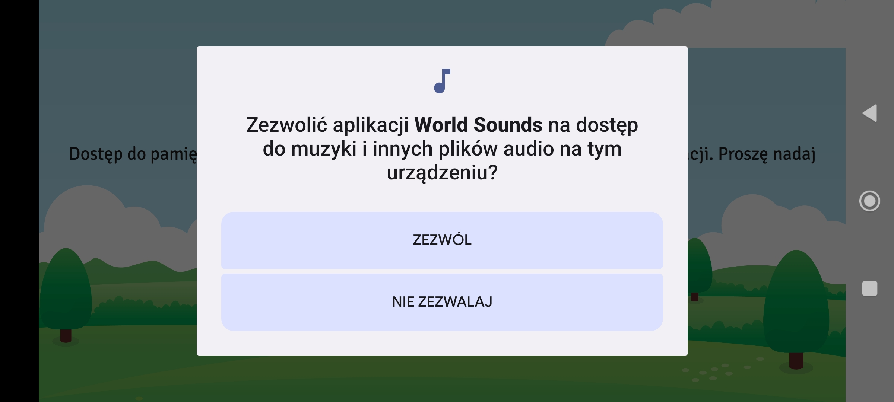
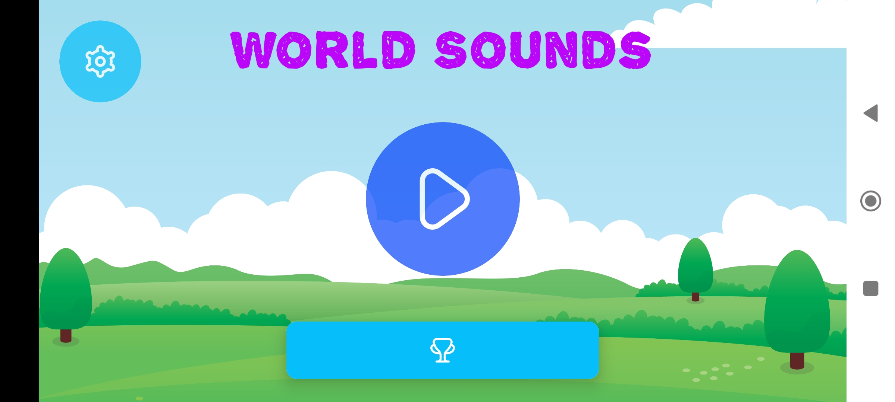
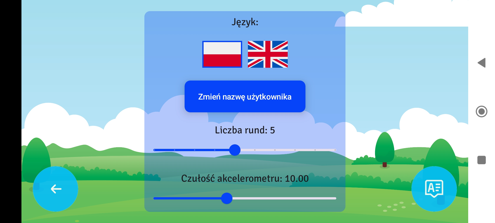
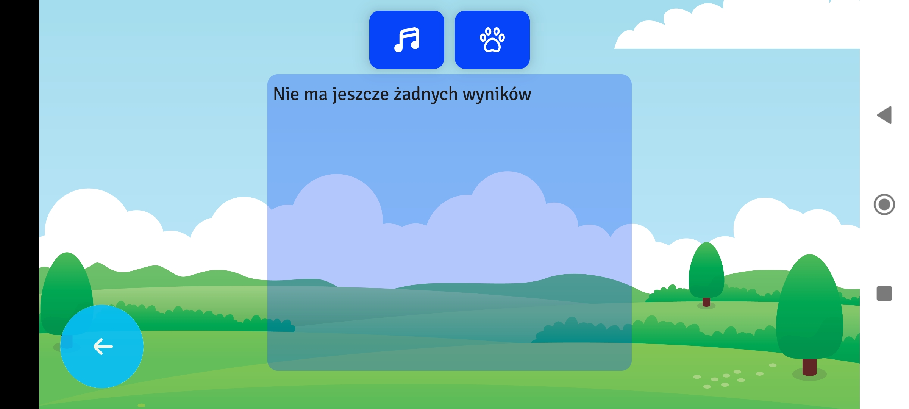
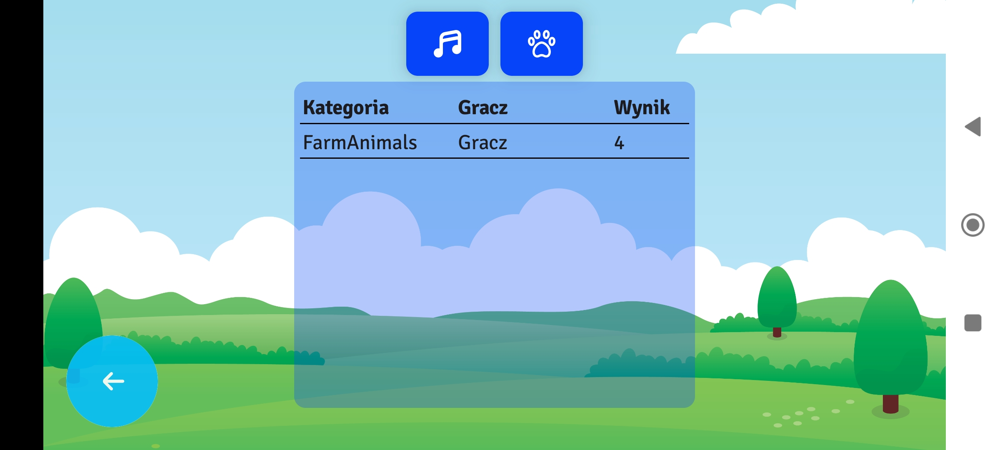
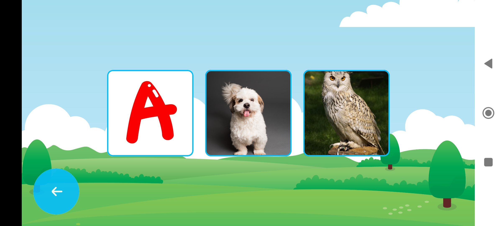
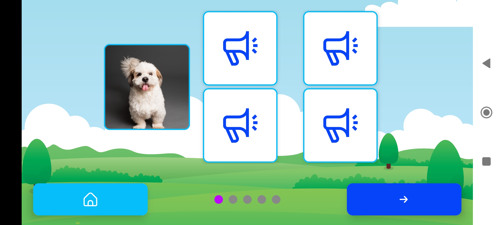
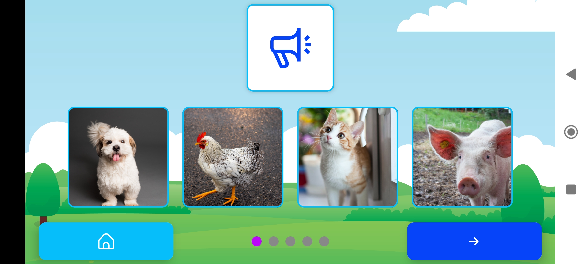
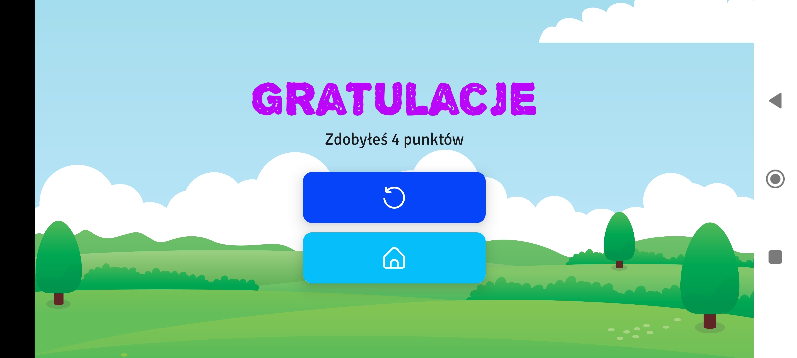

<h1>WorldSounds - Mobile App</h1>

    The aim of this project is to create a simple educational application for children. It is a Native Android mobile
    game
    made in Kotlin and JetpackCompose in the form of an audio-visual quiz that involves matching the sound to the
    appropriate picture and vice versa. There are several categories of images and sounds to choose from, including the
    alphabet, domestic animals, and wild animals.

<h2>Game Categories</h2>

    At the base, the game contains three fundamental categories. It is possible to add additional categories
    independently, while adhering to the rules:
<ul>
    <li>the folder with the new category should be placed on the device in the Files → Documents (Documents) →
        WorldSounds folder,</li>
    <li>the name of the folder with the category will also be the name of the category,</li>
    <li>within the folder, the image-sound pairs can have any names provided that each pair will have identical names
        differing only by the extension (for example, a pair dog.jpg and dog.mp3).</li>
</ul>

<h2>App Instruction</h2>

    Upon installing and launching the application, the user will be presented with a screen to grant permissions. It is
    necessary to consent to read and write access in the phone's internal memory.

    After the permissions have been correctly granted, the application's start screen opens. Here, the user can choose
    whether to go to the application settings, view the list of top scores, or start the game by pressing one of the
    three
    available buttons.

    Selecting the button located in the top left corner of the screen will lead the player to the settings panel. There
    are
    buttons there that allow changing the application's language, the player's name, the number of rounds, the
    accelerometer
    sensitivity, as well as buttons to return to the application's main screen and information about the authors.

    The elongated button at the bottom of the screen marked with a trophy icon leads to the high scores screen. There,
    as
    the name suggests, are the best results of individual players using the device, depending on the game mode.

    The largest button in the center of the screen allows the game to start. First, the player must decide in which mode
    they want to play. Two are available:
<ul>
    <li>marked with musical notes, the mode of selecting the matching sound to the picture,</li>
    <li>marked with a paw, the mode of selecting the matching picture to the sound.</li>
</ul>

    Then, the player selects one of the available categories. Initially, the game includes three basic image-sound
    groups.
    These are the alphabet, domestic animals, and wild animals.

<h3><b>Sound to Picture game mode</b></h3>

    In the case of selecting the first game mode, one picture from the chosen category will appear on the screen along
    with
    four buttons indicating four possible sounds that match the picture. Pressing one of them or shaking the phone will
    play
    the selected sound effect. In the game, the user's task is to select the correct sound and move to the next round. A
    point for guessing will be awarded only if the image-sound pair is correctly chosen on the first attempt. In case of
    a
    mistake, the incorrectly chosen option will disappear from the screen.

<h3><b>Picture to Sound game mode</b></h3>

    This mode works identically to the previous one, with the difference that instead of four sounds and one picture,
    four
    pictures and one sound will appear on the screen.

    After completing the number of rounds selected in the settings, the player will receive information on how many
    points
    they have scored. They can then start the game in the chosen category from scratch or return to the start screen.

